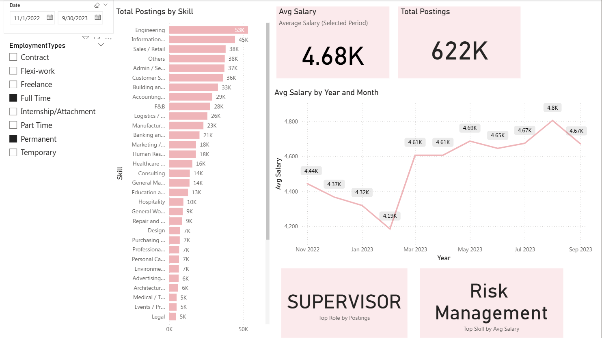

# 💼 Salary Analysis & Market Benchmarking Dashboard (Power BI)

This Power BI dashboard analyzes Singapore job postings (Nov 2022 – Sep 2023), benchmarking average salaries, skill demand, and role popularity for HR consulting insights.

---

## 📊 Dashboard Preview


---

## 📈 Key Insights
- **Top Skills by Demand:** Engineering and IT dominate with over 50 K postings.
- **Average Salary:** 4.68 K SGD (selected period).
- **Trend:** Salaries dipped early 2023 and recovered by mid-year (+10 % MoM).
- **Top Role:** **Supervisor**  
- **Top Skill by Pay:** **Risk Management**

---

## 🧰 Tools & Techniques
Power BI Desktop | Power Query | DAX | GitHub | VS Code

---

## 🗂️ Files
| File | Description |
|------|--------------|
| `Salary_Benchmark.pbix` | Power BI report file |
| `data/SGJobData.csv` | Source dataset |
| `images/dashboard_overview.png` | Dashboard preview |
| `README.md` | Project documentation |

---

## 🏁 How to Use
1. Clone the repo  
   ```bash
   git clone https://github.com/pinghar/salary-benchmark-powerbi.git
